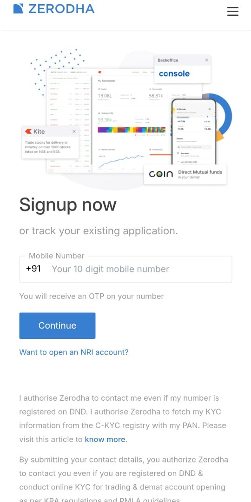
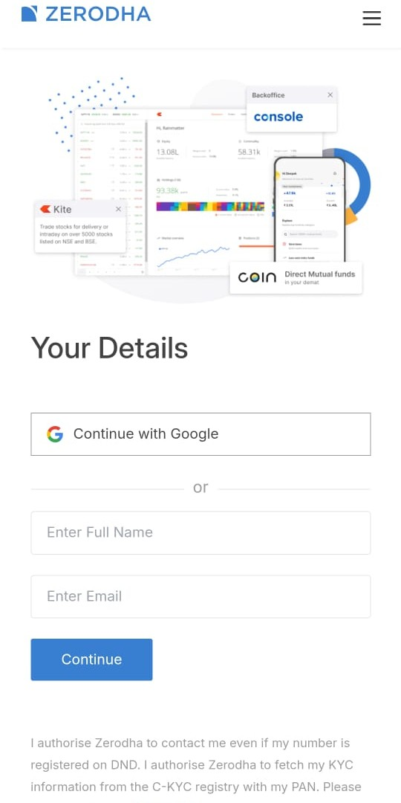

# Zerodha Frontend Clone

A fully responsive Zerodha frontend clone built using **ReactJS**. This project replicates the user interface of the popular stock trading platform, providing a sleek and modern design with smooth functionality.

## Features

- **Responsive Design:** Optimized for mobile, tablet, and desktop screens.
- **Dashboard UI:** A clean and intuitive dashboard similar to Zerodha's.
- **Interactive Components:** Includes navigation bar, sidebar, and dummy forms.
- **React Components:** Modular and reusable components for scalability.

## Technologies Used

- **ReactJS:** Framework for building the user interface.
- **React Router DOM:** For seamless navigation between pages.
- **CSS:** For styling and responsive design.

## Overview of Zerodha Frontend Clone

### Dashboard View


### Signup Page


### Mobile Responsive View






## Installation and Setup

Follow these steps to clone and set up the project locally:

1. **Clone the repository**
   ```bash
   git clone https://github.com/alok19d/zerodha-frontend-clone.git
   ```

2. **Navigate to the project directory**
   ```bash
   cd zerodha-clone
   ```

3. **Install dependencies**
   ```bash
   npm install
   ```

4. **Start the development server**
   ```bash
   npm run dev
   ```

5. **Access the application**
   Open [http://localhost:5173](http://localhost:5173) in your browser to view the project.

## How to Contribute

1. Fork the repository.
2. Create a new branch for your feature or bugfix.
   ```bash
   git checkout -b feature/your-feature-name
   ```
3. Commit your changes.
   ```bash
   git commit -m "Add your feature description here"
   ```
4. Push the branch to your forked repository.
   ```bash
   git push origin feature/your-feature-name
   ```
5. Open a pull request in the original repository.

## Future Enhancements

- Integrate charting libraries (e.g., Chart.js, D3.js) to display dummy trading data.
- Add a login/signup authentication flow.
- Simulate stock trading functionality.
- Include dark mode for better user experience.

## Acknowledgements

- **Zerodha:** Inspiration for the design and features.
- **ReactJS Community:** For extensive documentation and support.

---
